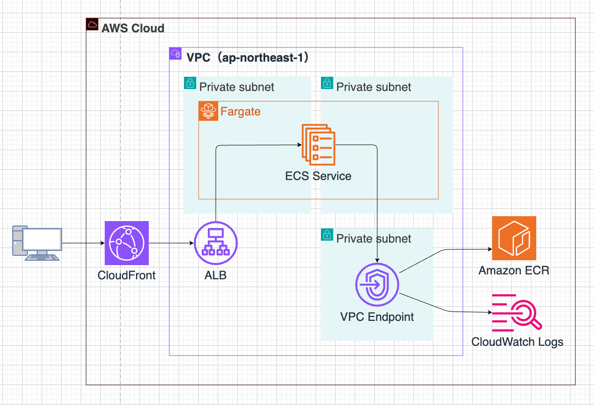
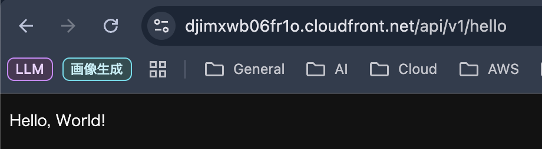

# ECSサンプル（勉強用）

ECS Fargateで稼働するWeb APIサーバーのサンプル構成です。

## インフラ構成

このリポジトリでは、CloudFrontを公開入口にし、その背後にALBとECS Fargateを配置する構成を採用しています。

アプリケーションはプライベートサブネット上で稼働します。

ユーザーがアプリケーションに到達するまでのサービスの流れは以下のとおりです。

1. ユーザーはインターネット経由でCloudFrontへHTTPSでアクセスします。
2. CloudFrontはVPC Originとして設定したALBへリクエストを転送します。
3. ALBは受信したリクエストをECS ServiceのタスクへHTTP:8080でルーティングします。
4. ECSタスクで稼働するアプリケーションがリクエストを処理し、レスポンスを返します。

また、ECSタスクはアプリケーションの運用に必要なAmazon ECR、CloudWatch Logs、Amazon S3へ、VPC Endpoint経由でアクセスします。

## ディレクトリ構成

- `terraform/`: VPC、サブネット、VPC Endpoint、ALB、ECS Cluster、ECR、CloudFrontなどのインフラを管理します。
- `ecspresso/`: Terraformを参照しながら、ECSサービスとタスク定義を管理します。
